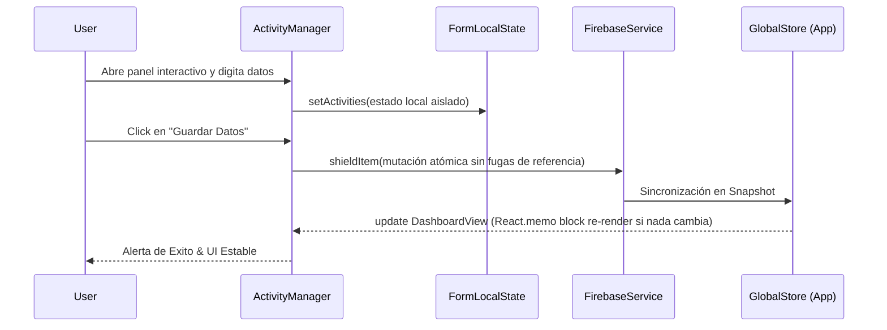

# 📚 Documentación para Desarrolladores (Stratexa Dashboard)

## 🏗️ Arquitectura del Sistema (Critical Nuclear Shield)

La versión actual implementa una arquitectura rigurosa para garantizar la sincronización entre datos calculados en memoria y el almacenamiento remoto en Firestore (Supabase/Firebase Docs). 

### Diagrama de Flujo (CRUD Nuclear)



## 🛡️ Estándar de Tipos y Zod Schemas Recomendado

Debido a que el código contiene estructuras complejas como `DashboardItem`, a continuación se provee el Schema de Validación **Zod** equivalente para usar si hay futuras iteraciones de API routes o server actions:

```typescript
import { z } from "zod";

export const ActivityItemSchema = z.object({
  id: z.string().uuid(),
  label: z.string().min(1, "El nombre no puede estar vacío"),
  targetCount: z.number().nonnegative(),
  completedCount: z.number().nonnegative()
});

export const PartialDashboardItemSchema = z.object({
  id: z.union([z.string(), z.number()]),
  indicator: z.string().min(1),
  weight: z.number().min(0).max(100),
  frequency: z.enum(['monthly', 'weekly']).optional(),
  weeklyGoals: z.array(z.number().nullable()).optional(),
  weeklyProgress: z.array(z.number().nullable()).optional(),
  monthlyGoals: z.array(z.number().nullable()),
  monthlyProgress: z.array(z.number().nullable()),
  
  // Soporte a la característica "Activity Mode / Actividades Desglosadas"
  isActivityMode: z.boolean().optional(),
  activityConfig: z.record(
    z.string(), // key como index del período temporal (mes/semana)
    z.array(ActivityItemSchema)
  ).optional()
});

export type ValidatedDashboardItem = z.infer<typeof PartialDashboardItemSchema>;
```

## 📜 Ejemplos de Uso en Componentes (Memoización)

### Patrón `React.memo` para evitar colisiones
Todos los componentes funcionales principales (Core View) deben seguir este molde:

```tsx
import React, { useMemo, useCallback } from 'react';

/**
 * Representa X componente en el árbol reactivo
 * @param {MiComponentProps} props - Properties controladas desde padre
 */
export const ModuloSeguro = React.memo(({ estado, onUpdate }: MiComponentProps) => {
  // Callback aislado
  const handleSafeAction = useCallback(() => {
    onUpdate({ merge: true, shield: true });
  }, [onUpdate]);

  return <div onClick={handleSafeAction}>UI Complex</div>
});
```

*Nota: Siempre incluir JSDoc detallado al definir interfaces de props nuevas para integrarse con IntelliSense global.*
