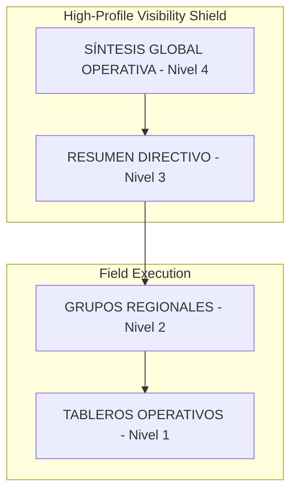

# Stratexa Dashboard v7.8.27
Business Intelligence System for IPS • **ELITE-PLATINUM Architecture**

## 🛡️ Platinum Ultra Shield: Aislamiento Total
Esta versión implementa una arquitectura de **Aislamiento Multi-App** definitiva. El sistema garantiza que los datos operativos, configuraciones y usuarios estén blindados por cliente, utilizando prefijos de colección estrictos (`tbl_`) y reglas de seguridad de nivel granular.

## 🚀 Características de Vanguardia (v7.8.16)
- **Institutional Hierarchy Resilience (v7.8.27)**: Rediseño total de la navegación jerárquica. Se implementó el concepto de "Resumen Directivo" y "Síntesis Global Operativa" para diferenciar claramente las vistas agregadas de los tableros de ejecución.
- **Selective Visibility Shield (v7.8.27)**: Blindaje de niveles superiores. El acceso a la "Síntesis Global" (Nivel 4) está restringido exclusivamente a roles Directivos y Administradores, ocultando la complejidad a usuarios operativos.
- **Smart Breadcrumb (v7.8.27)**: Motor de migas de pan inteligente que elimina redundancias visuales (ej. oculta el nombre del grupo si ya está implícito en el título del consolidado) y mejora la orientación espacial.
- **Aggregate Write Protection (v7.8.16)**: Blindaje contra escrituras accidentales en tableros virtuales. El sistema detecta intentos de edición desde vistas consolidadas y redirige automáticamente a tableros físicos válidos.
- **Hybrid Identity Shield (v7.8.16)**: Soporte nativo para esquemas de identidad mixtos (numéricos y string). Permite el uso de mnemónicos en indicadores sin pérdida de integridad durante la persistencia en Firestore.
- **Supreme Universal Persistence (v7.8.16)**: Desacoplamiento total del estado de expansión. Se eliminó el auto-expand redundante al navegar por General y se optimizó el layout móvil (Touch Targets >44px).
- **Adaptive Mobile Layout V5**: Motor responsivo optimizado bajo regla `UX001`. Sidebar con botones de gran tamaño (44px) y navegación fluida por gestos.

## 📋 Guía de Inicio Rápido
1.  **Instalación**: `npm install --legacy-peer-deps`
2.  **Entorno**: Configurar variables en `.env.local` conectadas al proyecto `prior-01`.
3.  **Ejecución Dev**: `npm run dev`
4.  **Despliegue Hosting**: `npm run build && firebase deploy --only hosting:tablero`

## 🧪 Integridad y Pruebas
El sistema cuenta con un motor de validación que se ejecuta antes de cada despliegue:
- **Universal Sum**: Validación agresiva de indicadores acumulativos.
- **Hierarchy Integrity**: Verificación automática de rutas de navegación.
- **Atomic Navigation**: Prueba de persistencia de nodos expandidos.
- **Identity Integrity**: Verificación de colisiones de IDs híbridos en el gestor de KPIs.

## 🧠 Arquitectura Core (v7.8)

### 📊 Estructura Jerárquica UX-ELITE
El sistema organiza la información en un árbol de decisión de 4 niveles, diseñado para el cumplimiento normativo e institucional.

### 🧱 Componentes Principales
| Componente | Responsabilidad | Estado de Persistencia |
| :--- | :--- | :--- |
| `App.tsx` | Orquestador Global y Auth | Firebase Auth + LocalStorage (Año, Sidebar) |
| `HierarchySidebar.tsx` | Navegación Jerárquica y Filtros Regionales | LocalStorage (expandedNodes_v3) |
| `DashboardView.tsx` | Visualización de KPIs y Reporte Ejecutivo | In-memory (State) |
| `IndicatorManager.tsx` | Gestión de Datos e Inyecciones IA | Firestore Transactional |
| `firebaseService.ts` | Capa de Abstracción de Datos | Firestore `tbl_` Collections |

### 🛠️ Guía para Desarrolladores

#### Flujo de Agregación de Datos
El sistema utiliza un motor de agregación virtual que no requiere almacenamiento redundante:
1. Se recuperan todos los tableros del cliente.
2. `aggregationUtils` identifica los hijos de cada nivel superior.
3. Se calculan promedios ponderados en tiempo real.
4. Se inyecta un ID virtual `agg-` para prevenir colisiones con tableros físicos.

#### Reglas de UX (UX001)
- **Touch Targets**: Todos los elementos interactivos deben tener al menos 44px de altura/anchura.
- **Safe Areas**: Padding automático de `0.75rem` en cabeceras para prevenir cortes en dispositivos con Notch.
- **Typography**: Escalar al 85% solo en dispositivos móviles para mantener densidad.

---
*- **Versión de Producción:** `v7.8.28-UX-ELITE` (2026-03-01)*
*- **Arquitectura**: Platinum Ultra Shield (Hybrid ID Engine)*
*- **Copyright**: © 2026 Prior Consultoría / Stratexa Intelligence*
