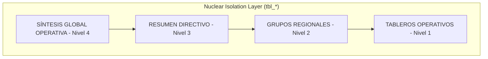

# Stratexa Dashboard v8.7.2
Business Intelligence System for IPS • **CRITICAL SHIELD Architecture**

## 🛡️ Critical Nuclear Shield: Estabilidad Total
Esta versión implementa una arquitectura de **Persistencia Nuclear** definitiva. El sistema garantiza que los datos operativos, configuraciones de actividades y metas estén blindados contra fallos de sincronización, utilizando guardados atómicos y una lógica de aislamiento de red durante el commit.

## 🚀 Características de Vanguardia (v8.7.2)
- **CRUD Nuclear (Atomic Persistence)**: Refactorización del motor de guardado para evitar pérdida de `activityConfig`. Cada interacción envía el estado completo para garantizar integridad total.
- **Auto-Scroll Inteligente (Precision Focus)**: Posicionamiento automático en la semana actual al abrir la vista anual (600ms delay) para visibilidad inmediata.
- **Pureza Visual (No-Shadow Policy)**: Gráficos ultra-limpios con opacidad de área al 2% y eliminación de sombras persistentes al 75%.
- **Pre-Deploy Shielding**: Nuevo script de verificación que impide el despliegue si hay discrepancias de versión entre `App.tsx` y `package.json`.
- **UX Privada**: Eliminación de etiquetas de versión en la pantalla de login para una interfaz más limpia y profesional.

## 📋 Guía de Inicio Rápido
1.  **Instalación**: `npm install --legacy-peer-deps`
2.  **Entorno**: Configurar variables en `.env.local` conectadas al proyecto `prior-01`.
3.  **Ejecución Dev**: `npm run dev`
4.  **Despliegue Hosting**: `npm run build && firebase deploy --only hosting`

## ⚙️ Documentación Exhaustiva para Desarrolladores
- Ver **[DEVELOPER_DOCS.md](./DEVELOPER_DOCS.md)** para Diagramas de Flujo Mermaid de Arquitectura CRUD.
- Descripciones nativas **Zod Schemas** para API/Endpoints.
- Casos de validación con `React.memo` explicados.

## 🧪 Integridad y Pruebas
El sistema cuenta con un motor de validación que se ejecuta antes de cada despliegue:
- **AI Consistency Check**: Validación de que el análisis IA coincide con el cálculo de cumplimiento manual.
- **Universal Sum**: Validación agresiva de indicadores acumulativos.
- **Hierarchy Integrity**: Verificación automática de rutas de navegación.
- **Atomic Navigation**: Prueba de persistencia de nodos expandidos.

## 🧠 Arquitectura Core (v8.6)

### 📊 Estructura Jerárquica UX-ELITE
El sistema organiza la información en un árbol de decisión de 4 niveles.

### 🧱 Componentes Principales
| Componente | Responsabilidad | Estado de Persistencia |
| :--- | :--- | :--- |
| `App.tsx` | Orquestador Global y Auth | Firebase Auth + LocalStorage |
| `aiService.ts` | Inteligencia Artificial y Análisis | Simulación Sincronizada (GPT-4/o1) |
| `DashboardView.tsx` | Visualización de KPIs y Reporte | In-memory State |
| `ActivityManager.tsx` | Gestión Detallada de Elementos | Global State Sync |

---
*- **Versión de Producción:** `v8.7.2-CRITICAL-SHIELD` (2026-03-22)*
*- **Arquitectura**: Critical Nuclear Shield (Atomic Isolation)*
*- **Copyright**: © 2026 Prior Consultoría / Stratexa Intelligence*
