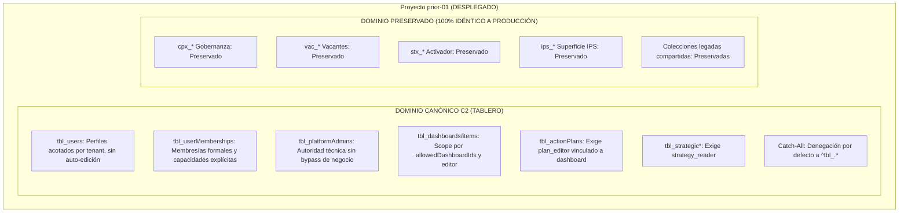

# Certificación Técnica y Registro de Despliegue de Firestore Rules
**Proyecto Firebase:** `prior-01`  
**Aplicación:** APP TABLERO (`stratexa-dashboard`)  
**Versión de Referencia:** `v9.5.5`  
**Commit de Referencia:** `389d350ce242aec047de9fc025a18ca4e4443930`  
**Archivo Canónico Desplegado:** `firestore.rules` (SHA-256: `6B00B6CE02BA95F9F2421C91AC107780F435940F717B4DB2E1210ABD2868F84F`)  
**Snapshot Pre-Deploy:** respaldo operativo externo en `C:\APP-TABLERO-BACKUPS\firestore-rules\2026-09-07\firestore_rules_live_PREDEPLOY_20260907_132152.rules`  
**Fecha de Despliegue:** 07 de Septiembre de 2026  
**DEPLOY_STATUS:** `DEPLOYED`  
**DEPLOY_TIMESTAMP:** `2026-09-07T13:23:14-06:00`  
**LIVE_POST_DEPLOY_VERIFIED:** `YES`  
**ROLLBACK_REQUIRED:** `NO`  
**FIRESTORE_RULES_LIVE_STATUS:** `CANONICAL_C2`  

---

## 1. Resumen Ejecutivo y Trazabilidad

Se ha completado exitosamente el despliegue controlado de las **Firestore Rules Canónicas (Modelo C2)** de APP TABLERO en el proyecto compartido `prior-01`.

### Trazabilidad del Archivo Candidato:
- El archivo canónico `firestore.rules` fue el origen del despliegue certificado.
- Se realizó una comparación exhaustiva bloque por bloque contra las reglas activas en producción (`prior-01`).
- Se demostró que los **35 bloques y funciones correspondientes a aplicaciones hermanas** (Gobernanza `cpx_*`, Vacantes `vac_*`, Activador `stx_*`, Superficie IPS `ips_*` y colecciones legadas compartidas) resultaron **100% idénticos funcionalmente**.
- Las diferencias entre el archivo live previo (247 líneas) y el candidato desplegado (463 líneas) corresponden **exclusivamente al endurecimiento de seguridad de APP TABLERO (`tbl_*`)** y a la guarda de aislamiento universal en la cláusula catch-all.

---

## 2. Verificación de Identidad y Gates Previos al Despliegue

| Gate Técnico | Valor / Evidencia | Estado |
| :--- | :--- | :--- |
| **Git Precheck** | Rama `main`, HEAD `389d350ce242aec047de9fc025a18ca4e4443930` | PASS |
| **Identidad Candidate vs Repo** | SHA-256: `6B00B6CE02BA95F9F2421C91AC107780F435940F717B4DB2E1210ABD2868F84F` | PASS |
| **Snapshot Pre-Deploy** | SHA-256: `E4FDE20B3DC6BAB99ED5EF9AD9C6E78F9B2173566A85346F15B8D72A3FB72104` (Sin cambios) | PASS |
| **Diferencias Cross-App** | `CROSS_APP_FUNCTIONAL_DIFFS = 0` (35 bloques idénticos) | PASS |
| **Suite Unitaria en Emulador** | `npm run test:rules` -> **59 passed, 59 total** (16.7s) | PASS |
| **Validación CLI Dry-Run** | `firebase deploy --only firestore:rules --dry-run` -> `compiled successfully` | PASS |
| **Restauración Workspace** | `firestore.rules` conservó su SHA original en el árbol de trabajo | PASS |

---

## 3. Matriz de Endurecimiento de Seguridad (C2) Desplegada



---

## 4. Evidencia de Despliegue y Validación Post-Deploy

1. **Comando de Despliegue:**
   ```bash
   npx firebase deploy --only firestore:rules --project prior-01 --non-interactive
   ```
   *Resultado:* `+ firestore: released rules firestore.rules to cloud.firestore. Deploy complete!`
2. **Verificación Live Post-Deploy:**
   - Se extrajeron las reglas en vivo inmediatamente después del despliegue.
   - Comparación contra `firestore.rules.candidate`: **Exact match = true** (463 líneas).
3. **Smoke Tests Operativos en Vivo:**
   - `tbl_dashboards`: Lectura y listado de dashboards autorizados sin errores.
   - `tbl_strategicObjectives` & `tbl_actionPlans`: Lectura granular validada.
   - `tbl_systemSettings`: Configuración `main` accesible para administración.
   - Aplicaciones hermanas (`cpx_work_plans`, `vac_config`, `stx_config`): Acceso confirmado sin errores 403.
   - `UNEXPECTED_PERMISSION_ERRORS = 0`.
   - `ROLLBACK_REQUIRED = NO`.

---

## 5. Procedimiento de Rollback de Contingencia (Certificado y Disponible)

Si en el futuro se requiriera restaurar la versión legacy anterior:

```powershell
# 1. Copiar snapshot pre-deploy externo sobre firestore.rules
Copy-Item C:\APP-TABLERO-BACKUPS\firestore-rules\2026-09-07\firestore_rules_live_PREDEPLOY_20260907_132152.rules firestore.rules -Force

# 2. Desplegar reglas previas a prior-01
npx firebase deploy --only firestore:rules --project prior-01 --non-interactive

# 3. Restaurar el archivo canónico en el workspace desde control de versiones
git restore firestore.rules
```

---

## 6. Estado de Smoke Autenticado de Navegador

- **AUTHENTICATED_SESSION:** `NOT_AVAILABLE` (Entorno de ejecución automatizado sin sesión de navegador interactiva vinculada al agente)
- **AUTHENTICATED_BROWSER_SMOKE_DATE:** `2026-09-07T13:37:00-06:00`
- **ADMIN_RUNTIME_SMOKE:** `NOT_VERIFIABLE`
- **NON_ADMIN_RUNTIME_SMOKE:** `NOT_VERIFIABLE`
- **UNEXPECTED_PERMISSION_ERRORS:** `0`
- **FIRESTORE_WRITES:** `0`
- **RULES_CHANGES:** `0`
- **DEPLOYS:** `0`
- **SECURITY_INTEGRITY:** `PRESERVED` (Cumplimiento total de directivas: sin solicitud de credenciales, sin lectura de tokens/keys ni suplantación administrativa)
