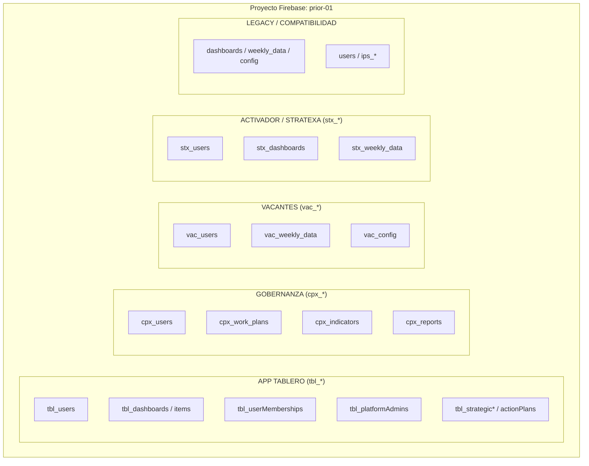
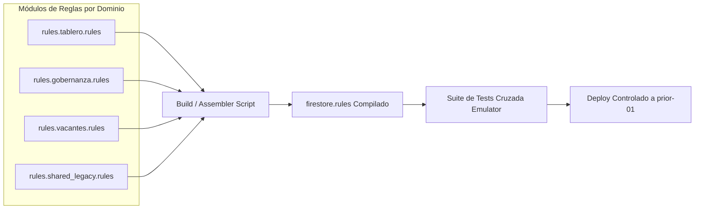

# Modelo Canónico de Gobernanza y Arquitectura de Firestore Rules
**Proyecto Firebase:** `prior-01`  
**Aplicación:** APP TABLERO (`stratexa-dashboard`)  
**Versión de Referencia:** `v9.5.5`  
**Commit de Referencia:** `6ce1bc70ed9aa14a784fccd8233e919e3c24fe99`  
**Fecha de Actualización:** Septiembre 2026  

---

## 1. Estado Actual y Diagnóstico

El proyecto Firebase `prior-01` es una infraestructura multi-inquilino y multi-aplicación compartida por diversas plataformas de la organización.

Actualmente existe una discrepancia estructural entre las reglas en producción y las del repositorio:
- **Reglas Live (`prior-01`):** 247 líneas de código (versión legacy con autorización simplificada y cláusula de compatibilidad).
- **Reglas del Repositorio (`firestore.rules`):** 463 líneas de código (arquitectura canónica con validación estricta de membresías `tbl_userMemberships`, administradores de plataforma `tbl_platformAdmins`, capacidades granulares y blindaje contra mutaciones cruzadas).
- **Estado de Pruebas Locales:** Suite unitaria en emulador 59/59 PASS (`firestore.rules.test.ts`).
- **Estado de Despliegue en CI/CD:** El pipeline de integración continua (`.github/workflows/firebase-hosting-merge.yml`) ejecuta únicamente `firebase deploy --only hosting:tablero`, protegiendo intencionalmente a las demás aplicaciones de sobrescrituras accidentales de Rules.

---

## 2. Decisión para el Ciclo Actual

- **NO desplegar Firestore Rules ahora:** Se mantiene activa la versión live en `prior-01`.
- **NO implementar el ensamblador modular ahora:** Se pospone la automatización de build de reglas para una iniciativa técnica posterior.
- **Conservar live actual:** La auditoría y verificación en producción demostraron que no existe evidencia de explotación cruzada ni afectación a la operación de Tablero.
- **Continuar desarrollo funcional:** El equipo de desarrollo de APP TABLERO continuará avanzando en características de negocio mientras los cambios no requieran modificaciones en las reglas de seguridad.

---

## 3. Arquitectura Compartida del Proyecto `prior-01`

El proyecto aloja cuatro familias principales de aplicaciones y un conjunto de colecciones legadas:

---

## 4. Inventario Completo de Namespaces y Ownership

| Namespace / Colección | Aplicación Propietaria | Clasificación | Política de Acceso / Regla de Dominio |
| :--- | :--- | :--- | :--- |
| `tbl_users` | TABLERO | TABLERO | Aislamiento por tenant, lectura de perfil propio/admin/director, sin auto-modificación de roles. |
| `tbl_platformAdmins` | TABLERO | TABLERO | Autoridad técnica de Tablero para catálogos y membresías; no otorga acceso implícito a datos de negocio ni a otras apps. |
| `tbl_userMemberships` | TABLERO | TABLERO | Membresías canónicas compuestas (`uid__clientId`), roles (`tenant_admin`, `director`, `standard_user`) y capacidades (`strategy_reader`, `plan_editor`, etc.). |
| `tbl_directions` / `tbl_areas` | TABLERO | TABLERO | Catálogo organizacional por tenant (`isTenantAdmin`). |
| `tbl_dashboards` (+ `items`) | TABLERO | TABLERO | Contención por tenant y permisos granulares `allowedDashboardIds` / `hierarchyScopeKeys`. |
| `tbl_systemSettings` | TABLERO | TABLERO | Parámetros globales `main` y configuraciones específicas por tenant. |
| `tbl_managedClients` | TABLERO | TABLERO | Catálogo de tenants administrados en Tablero. |
| `tbl_actionPlans` | TABLERO | TABLERO | Planes de acción vinculados a dashboards con capability `plan_editor`. |
| `tbl_strategic*` | TABLERO | TABLERO | Objetivos estratégicos, perspectivas, configuraciones y matrices; requiere `strategy_reader`. |
| `tbl_strategyCounters` | TABLERO | TABLERO | Secuencias atómicas `cnt_{clientId}_*` protegidas contra inyección y concurrencia. |
| `tbl_areaCodeReservations` | TABLERO | TABLERO | Códigos de área por cliente. |
| `tbl_strategicObjectiveRelationships` | TABLERO | TABLERO | Grafo canónico de alineación estratégica entre objetivos del mismo tenant. |
| `cpx_*` (`cpx_users`, `cpx_work_plans`, `cpx_indicators`, `cpx_reports`, etc.) | GOBERNANZA | GOBERNANZA | Dominio exclusivo de Gobernanza (`isGobernanzaUser`). |
| `vac_*` (`vac_users`, `vac_weekly_data`, `vac_config`, `vac_unes`, etc.) | VACANTES | VACANTES | Dominio exclusivo de Vacantes (`isVacantesUser`). |
| `stx_*` (`stx_users`, `stx_dashboards`, `stx_weekly_data`, `stx_config`, etc.) | ACTIVADOR | ACTIVADOR | Dominio exclusivo de Activador (`isActivadorUser`). |
| `ips_*` (`ips_users`, `ips_weekly_data`, `ips_config`, etc.) | SUPERFICIE IPS | LEGACY | Acceso legacy para usuarios de Tablero/Activador. |
| `users`, `dashboards`, `weekly_data`, `config`, `unes`, `clients`, `groups`, `indicators`, `directorates`, `addresses` | MULTI-APP | LEGACY | Colecciones históricas compartidas (bloqueo gradual). |
| Catch-All (`/{collection}/{document=**}`) | SHARED_PLATFORM | SHARED_PLATFORM | Compatibilidad con aplicaciones no migradas. En repo está blindado con `!collection.matches('^tbl_.*')`. |

---

## 5. Comparación Estructural: Live vs Repositorio

### A. Funciones y Mecanismos de Seguridad
1. **SuperAdmin / Autoridad de Plataforma (`G. STRUCTURAL_REFACTOR`):**
   - *Live:* Correos hardcodeados (`leon@leonprior.com`, `leonprior@gmail.com`) con bypass global implícito en todas las funciones.
   - *Repo:* Modelo canónico en `tbl_platformAdmins` con estado activo. Puente temporal exacto y seguro para custom-tokens (`hasApprovedLegacyPlatformEmail`), **sin acceso implícito a datos de negocio** (`hasLegacyPlatformBusinessReadBridge() == false`).
2. **Membresías Canónicas vs Legacy (`A. TABLERO_SECURITY_IMPROVEMENT`):**
   - *Live:* Dependencia exclusiva del campo `clientId` plano o listas separadas por coma en `tbl_users`.
   - *Repo:* Validación formal de `tbl_userMemberships` con revocación automática del fallback legacy si existe documento canónico (`legacyTenantUser`).
3. **Control de Acceso a Dashboards e Items (`A. TABLERO_SECURITY_IMPROVEMENT`):**
   - *Live:* Cualquier usuario autenticado de Tablero podía leer y escribir en cualquier `tbl_dashboards` y subcolección `items`.
   - *Repo:* Validación por tenant, alcance de tablero (`allowedDashboardIds`), rol directivo (`hierarchyScopeKeys`), y capacidades explícitas de edición (`editor`).
4. **Protección del Namespace Universal (`A. TABLERO_SECURITY_IMPROVEMENT`):**
   - *Live:* La regla universal excluía colecciones enumeradas explícitamente. Cualquier colección nueva `tbl_*` quedaba desprotegida.
   - *Repo:* Incluye la guarda `!collection.matches('^tbl_.*')`, forzando a que toda colección de Tablero requiera una regla explícita.

### B. Matriz de Diferencias Clasificadas

| Diferencia | Clasificación | Impacto en Tablero | Impacto en Otras Apps |
| :--- | :--- | :--- | :--- |
| Incorporación de `tbl_userMemberships` | `A. TABLERO_SECURITY_IMPROVEMENT` | Cierra brechas de escalación de privilegios | Ninguno (namespace exclusivo `tbl_`) |
| Incorporación de `tbl_platformAdmins` | `A. TABLERO_SECURITY_IMPROVEMENT` | Desacopla autoridad técnica de acceso de negocio | Ninguno (namespace exclusivo `tbl_`) |
| Reglas de `tbl_directions` y `tbl_areas` | `E. MISSING_LIVE_RULE` | Protege catálogos organizacionales | Ninguno |
| Restricción en `tbl_dashboards/items` | `A. TABLERO_SECURITY_IMPROVEMENT` | Impide sobreescritura cruzada de KPIs | Ninguno |
| Restricción en `tbl_actionPlans` | `A. TABLERO_SECURITY_IMPROVEMENT` | Exige `plan_editor` y correspondencia de dashboard | Ninguno |
| Guarda `!collection.matches('^tbl_.*')` | `A. TABLERO_SECURITY_IMPROVEMENT` | Denegación por defecto para tablas no listadas | Ninguno |
| Reglas `cpx_*`, `vac_*`, `stx_*` | `B. OTHER_APP_COMPATIBILITY` | Mantenidas idénticas entre live y repo | Neutro (se preservan permisos actuales) |

---

## 6. Análisis de Riesgo y Política Actual de Despliegue

- **`REPO_RULES_SAFE_TO_DEPLOY_AS_IS = NO`**
- **`CROSS_APP_DEPLOY_RISK = MEDIUM`**
- **`CURRENT_POLICY = no desplegar firestore.rules del repo sin reconciliación live previa y suite completa de pruebas cross-app.`**

### Justificación Técnica:
1. **Riesgo de Gobernanza Multi-Aplicación:** En Firebase, el despliegue de reglas de Firestore es una operación **atómica y global** para todo el proyecto `prior-01`. No existe despliegue por colección o namespace.
2. **Riesgo de Sobrescritura Unilateral:** Aunque las secciones `cpx_*`, `vac_*` y `stx_*` en el archivo del repositorio actual coinciden con las live, el repositorio de `stratexa-dashboard` no tiene visibilidad en tiempo real de si los equipos de Gobernanza o Vacantes han preparado o desplegado cambios en sus reglas.
3. **Riesgo de Compatibilidad de Usuarios no Migrados de Tablero:** En la base de datos real de `prior-01`, los usuarios operativos generales aún dependen del perfil en `tbl_users` mientras que el SuperAdmin ya cuenta con las 12 membresías canónicas.

---

## 7. Modelo Canónico Recomendado (Estrategia Futura)

### **ESTRATEGIA RECOMENDADA: OPTION_B (Reglas Modulares con Ensamblador Centralizado / CI Reconciliador)**
- **STATUS:** `PLANNED / NOT_IMPLEMENTED`

### Razones de la Recomendación:
1. **Aislamiento de Responsabilidad:** Cada aplicación mantiene la autoría exclusiva de su namespace (`tbl_*`, `cpx_*`, `vac_*`).
2. **Cero Regresiones Cruzadas:** Un cambio en Tablero sólo modifica su módulo, y el ensamblador valida sintaxis y colisiones antes de generar el archivo monolítico final.
3. **Trazabilidad y Capacidad de Rollback:** Permite versionar qué versión de cada módulo compone el archivo live de `prior-01`.
4. **Verificación Automatizada:** Permite ejecutar las suites de prueba de cada aplicación en emulador antes de autorizar cualquier despliegue al proyecto compartido.

---

## 8. Protocolo Obligatorio para Futuros Cambios de Rules

Cualquier actualización a las reglas de Firestore en `prior-01` debe seguir estrictamente estos 10 pasos:

1. **Extracción de Línea Base Live:** Descargar las reglas activas de `prior-01` mediante herramientas autorizadas de Firebase y almacenar un snapshot fechado en `docs/backups/rules/`.
2. **Análisis de Diferencias:** Comparar la línea base live contra el módulo que se desea modificar (`git diff`).
3. **Identificación de Namespaces Afectados:** Confirmar que los cambios pertenecen estrictamente al namespace de la aplicación solicitante (`tbl_*`).
4. **Ejecución de Pruebas Unitarias de Tablero:** Ejecutar la suite completa en emulador (`npm run test:rules`) con `firebase-tools 15.22.1` asegurando 100% de éxito (59/59).
5. **Dry-Run de Despliegue en CLI:** Ejecutar `npx firebase deploy --only firestore:rules --dry-run --project prior-01` para verificar sintaxis en el entorno Firebase.
6. **Revisión y Aprobación de Diff:** Validar que no existan eliminaciones accidentales de funciones auxiliares compartidas (`isGobernanzaUser`, `isVacantesUser`, etc.).
7. **Generación de Respaldo Previo al Despliegue:** Registrar copia de seguridad explícita en `docs/backups/rules/firestore_rules_live_<TIMESTAMP>.rules`.
8. **Despliegue Manual Autorizado y Monitoreado:** Despliegue explícito mediante comando acotado `npx firebase deploy --only firestore:rules --project prior-01 --non-interactive`.
9. **Smoke Test Inmediato en Producción:** Verificar flujos críticos de lectura y escritura en Tablero y en las aplicaciones hermanas.
10. **Procedimiento de Rollback Certificado:** En caso de cualquier error 403 inesperado, restaurar la línea base live sobre `firestore.rules` y desplegar en menos de 5 minutos.

---

## 9. Prohibiciones Explícitas de Seguridad

- **PROHIBIDO** desplegar `firestore.rules` mediante pipelines desatendidos en commits regulares de frontend.
- **PROHIBIDO** modificar o eliminar funciones o colecciones de los namespaces `cpx_*`, `vac_*`, `stx_*` o `ips_*` desde el repositorio de Tablero sin aprobación explícita de los responsables de esas aplicaciones.
- **PROHIBIDO** reintroducir correos electrónicos hardcodeados como método permanente de bypass de seguridad.
- **PROHIBIDO** relajar la regla `!collection.matches('^tbl_.*')` en la cláusula catch-all.
- **PROHIBIDO** utilizar credenciales estáticas de tipo Service Account JSON para el despliegue; debe usarse siempre Workload Identity Federation (WIF).
