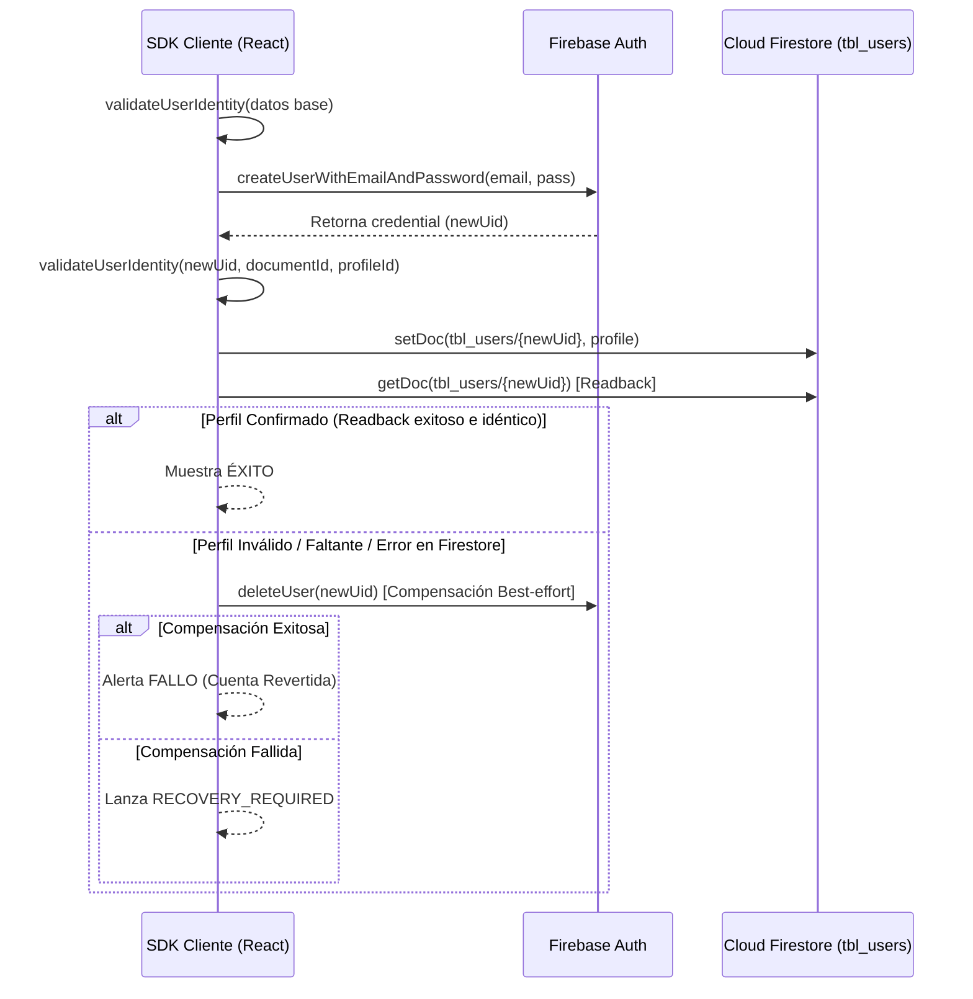

# Protocolo de Integridad de Identidad de Usuario (v9.4.4)

Este documento establece el contrato de validación de identidad y perfil para la plataforma Stratexa Dashboard (v9.4.4), implementado para mitigar el riesgo de cruce de datos o perfiles desalineados entre Firebase Authentication y Cloud Firestore.

## 1. Naturaleza No Atómica del Flujo de Registro en Clientes
El SDK de cliente de Firebase no permite ejecutar la creación de un usuario en Firebase Authentication y la inserción del documento correspondiente en Cloud Firestore dentro de una transacción atómica nativa.

Por ello, el flujo se define como **secuencial con validación estricta y compensación de mejor esfuerzo (best-effort)**:

## 2. Invariantes del Contrato de Identidad
Toda identidad registrada debe cumplir las siguientes invariantes validadas por `validateUserIdentity`:
- **Invariante de Alineación de UIDs:** `authUid` (de Firebase Auth), `documentId` (clave de Firestore `tbl_users/{uid}`) y `profile.id` (campo interno) deben ser estrictamente idénticos.
- **Detección de Perfil Histórico:** Si ya existe un perfil en Firestore con el correo de destino, no se permite crear una nueva credencial en Firebase Auth por riesgo de duplicidad o desalineación de datos históricos.
- **Consistencia de Roles:** Los roles permitidos en el Tablero se restringen a `Admin`, `Director` y `Member`. Se permite que cuentas con rol `Admin` tengan el campo `dashboardAccess` vacío.
- **Acceso Exclusivo por Perfil:** El acceso al Tablero depende del perfil (`tbl_users`) y rol asignados, no del correo electrónico del usuario.

## 3. Limitaciones del Cliente y Mitigación de Riesgos
- **Sin backend privilegiado:** La eliminación total de cuentas Auth junto con perfiles de Firestore requiere permisos de nivel de backend (`firebase-admin`). Por seguridad y para evitar costos en la nube de forma imprevista, no se desplegará código de backend en esta fase.
- **Compensación best-effort:** En caso de fallas de red posteriores a la creación de la credencial en Firebase Auth, la compensación en el cliente intentará eliminar la cuenta recién creada usando el objeto de sesión temporal. Si esto falla, el sistema devolverá el estado `RECOVERY_REQUIRED` y se requerirá intervención administrativa manual usando el Runbook de Conciliación.
